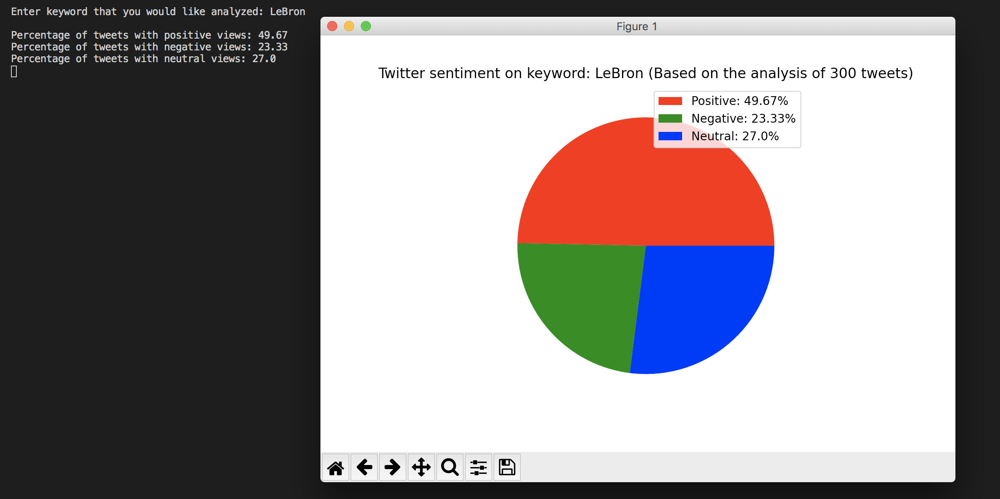

# Twitter Sentiment Analysis
# Using TextBlob and Tweepy to implement NLP (more specifically sentiment analysis) by searching through 300 tweets that contain a keyword and determining the overall sentiment on that keyword.
# 
